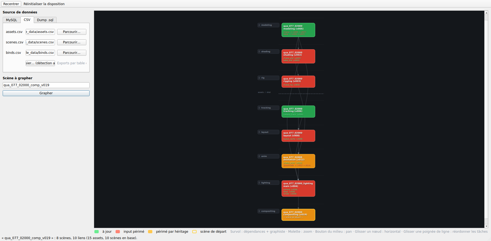

# Dedale — Graphe interactif de dépendances de scènes

Application de bureau **native** (Python + **PySide6**) qui, à partir du nom
d'une scène et d'une source de données, affiche un **graphe interactif** des
scènes dont elle dépend, coloré selon leur fraîcheur.

* un **rectangle** = une scène (une version) : en titre, le **nom de la table**
  (`scenes.name`, ou l'identité reconstruite pour un nœud issu d'assets) suivi
  de la version — ex. `tmp_024C_0060_lighting_main (v010)` ; puis **un output
  par ligne** — chaque output en **vert** s'il est à sa dernière version
  publiée, en **rouge** sinon avec la version disponible (`rendercam ⚠
  (v001 → v002)`). Un nom d'output est écrit sur ses **20 premiers
  caractères**, suivis de `...` s'il est tronqué
  (`camera_layer_01_camera_abc` → `camera_layer_01_came...`) ;
* une **ligne par type de tâche**, en deux niveaux (**asset** puis **shot**)
  séparés par un trait, le flux descendant ; lignes **réordonnables** en
  glissant leur poignée à gauche ; la **scène interrogée** reste tout en bas ;
* couleur du nœud par **propagation** : **vert** = tous les inputs à jour ·
  **rouge** = importe au moins un asset supplanté · **jaune** = obsolète *par
  héritage* seulement (ses inputs sont à jour mais un ancêtre est obsolète) ;
* nœuds **déplaçables horizontalement** (le Y reste verrouillé sur la ligne
  de la tâche) ; **survol** = dépendances directes mises en évidence + nom du
  **graphiste** ; **molette** = zoom ; **bouton du milieu** = déplacement.

Le rendu utilise `QGraphicsView` / `QGraphicsScene` avec des `QGraphicsItem`
personnalisés — **aucune librairie de graphe externe**.



---

## Installation

Python 3.9+ recommandé.

```bash
python -m venv .venv
source .venv/bin/activate        # Windows : .venv\Scripts\activate
pip install -r requirements.txt
```

`requirements.txt` contient `PySide6`, `mariadb` et `pymysql`. Le connecteur
`mariadb` (celui utilisé pour se connecter) nécessite la bibliothèque système
**MariaDB Connector/C** ; si `mariadb` n'est pas importable, l'appli bascule
automatiquement sur `pymysql` (100 % Python).

Le module `keyring` active la case **« Remember »**, qui enregistre le mot de
passe MySQL dans le **trousseau système** (Windows Credential Manager, macOS
Keychain, Secret Service sous Linux) :

* cocher la case l'enregistre **immédiatement** (puis à chaque connexion
  réussie et à la fermeture) ;
* **décocher supprime** l'entrée stockée ;
* le mot de passe n'est **jamais** écrit dans le fichier de réglages de
  l'appli. Sans `keyring`, la case est désactivée et rien n'est persisté.

## Lancement

```bash
python main.py
```

La fenêtre est un **split vertical** : les saisies (source de données + nom de
scène) à **gauche**, le graphe à **droite**.

1. Choisissez une **source de données** (onglets à gauche).
2. Saisissez le **nom de la scène**, ex. `qua_077_02000_comp_v019`.
3. Cliquez **Grapher**.

### Packaging (exécutable Windows)

Placez **`Dedale.ico`** à côté de `main.py`, puis :

```bat
python -m PyInstaller --onefile --windowed .\main.py --icon Dedale.ico --add-data "Dedale.ico;."
```

* `--icon` fixe l'icône **du fichier `.exe`** ;
* `--add-data "Dedale.ico;."` embarque l'icône pour qu'elle serve aussi
  **d'icône de fenêtre et de barre des tâches** à l'exécution. En `--onefile`,
  PyInstaller l'extrait dans un dossier temporaire : `resource_path()`
  (dans `main.py`) la retrouve via `sys._MEIPASS`, et retombe sur le dossier
  du script quand on lance depuis les sources.

Si `Dedale.ico` est absent, l'application démarre normalement, simplement sans
icône personnalisée.

Pour un essai immédiat sans base de données, utilisez le jeu d'exemple fourni
dans [`sample_data/`](sample_data) : onglet **Fichiers CSV** → *Dossier…* →
sélectionnez `sample_data`, puis graphez `qua_077_02000_comp_v019`.
(Le même jeu est disponible en dump SQL : `sample_data/dump.sql`.)

---

## Les deux outils

Le panneau de gauche propose deux onglets, qui partagent la même source de
données.

### « Scene to graph »

L'outil historique : saisir un nom de scène, cliquer **Graph**, explorer le
graphe de dépendances (voir le reste de ce document).

### « Graphist to graph »

Contrôle du travail d'un graphiste — reprend la sémantique de l'outil en ligne
de commande `checkGraph` :

| Champ        | Rôle                                                       |
|--------------|------------------------------------------------------------|
| Graphist     | nom du graphiste (colonne `scenes.author`)                  |
| Project      | **code court** (`tem`) ou nom complet (`tempete_26`), en préfixe |
| Scenes task  | ne liste que les scènes du graphiste **de ces tasks** : `all` (défaut) ou une liste séparée par espaces/virgules (`fx lighting`) |
| Filter assets tasks | *filtre d'affichage*, **sous les cases à cocher** : restreint les **assets** listés — `all` ou `fx anim tracking` |

> Ne pas confondre : **Scenes task** choisit *quelles scènes* apparaissent,
> **Filter assets tasks** restreint *quels assets* sont listés sous chacune.

> La colonne `scenes.project` contient le nom complet du show (`tempete_26`)
> alors que les **noms de scènes** utilisent son **code court** (`tem`). Les
> deux sont acceptés dans le champ *Project*, et c'est toujours le **code
> court** qui sert à reconstruire un nom de scène exploitable par l'outil
> « Scene to graph ».

**Check scenes** liste, **par ordre alphabétique**, toutes les scènes du projet
assignées au graphiste, et vérifie pour chacune — dans sa **dernière version** —
si ses imports sont à jour. Un import est *obsolète* si son flux d'output
possède une version publiée plus récente que celle bindée.

* le contrôle porte **toujours sur toutes les tasks d'assets** ; le champ
  *Filter assets tasks* ne fait que **filtrer l'affichage** — il s'applique donc
  instantanément, sans relancer le contrôle ;
* le nom du graphiste est cherché à l'identique, puis de façon **approchée sur
  le nom de famille** (`ginestra` → `sebastien ginestra`) ;
* chaque ligne d'asset affiche le **nom complet de la scène productrice**
  (`tem_024c_0035_fx_wave · arbre_cyprin`) ; les noms de scènes sont en
  **gras** et **repliés par défaut** — le triangle déplie le détail ;
* une fois dépliée, une scène liste **tous** ses imports : les périmés en
  **rouge** (`v009 → v011`) et ceux **à jour en vert** (`v011`) ;
* **survoler une ligne d'asset** affiche sa task, sa version, sa **date
  d'export** et le **graphiste qui l'a publié** (colonnes facultatives de la
  table `assets` : `date`/`created_at`… et `author`/`user`…) ;
* chaque ligne d'asset porte un bouton **×** (*mute*) qui masque la ligne ; les
  mutes survivent à un nouveau *Check scenes* et **Unmute all** les rétablit.
  Muter un asset ou changer une option **ne replie pas** les triangles déjà
  ouverts ;
* *Shots only* (coché par défaut) ne garde que les scènes de **plans**. Le tri
  se fait sur le **nom de l'entité**, pas sur la task : un plan se nomme
  `<séquence>_<numéro>` (`077_0100`, `024C_0035`, `seq010_sh0020` — les deux
  derniers segments comportent des chiffres) tandis qu'un asset porte un nom
  (`chaise`, `caravane_fx`, `robot_01`). La task seule ne suffisait pas : un
  asset peut porter une task **inconnue** (`grooming`, `sculpt`) voire une task
  de **niveau shot** (`caravane_fx` en task `fx`), et ces scènes ressortaient à
  tort. Une task de niveau asset portée par un plan reste écartée, une task
  inconnue portée par un plan est **conservée** — jamais de travail masqué par
  erreur. Si **aucune** entité du projet ne suit cette convention de nommage,
  l'outil retombe sur le niveau de la task plutôt que de vider la liste ;
* *Only scenes to update* masque les scènes entièrement à jour ;
* *Show assets up to date* (cochée par défaut) affiche ou masque les imports
  déjà à leur dernière version (les lignes vertes). Les masquer ne change ni
  le statut des scènes ni le compteur d'imports vérifiés ;
* *Show assets not imported* liste en plus, **en bleu**, les assets publiés sur
  le **plan** que la scène **n'importe pas**, **une seule ligne par asset, à sa
  dernière version publiée** — même quand plusieurs flux (variantes d'un même
  node) aboutissent au même libellé, seule la version la plus récente est
  affichée. Ils
  sont purement informatifs : ils **ne rendent jamais une scène obsolète**, ne
  sont pas comptés dans « to update », et n'entraînent pas l'affichage d'une
  scène sous *Only scenes to update*. Le filtre *Filter assets tasks* et le
  bouton **×** s'y appliquent aussi ;
* **double-cliquer une scène** bascule sur l'onglet « Scene to graph » et la
  graphe directement.

Les mutes sont **en mémoire uniquement** : rien n'est écrit dans la base.

#### « What's up ? »

Le bouton **What's up ?**, à gauche de *Unmute all*, bascule la même liste
d'un regroupement **par scène** à un regroupement **par date de publication**.
Les filtres sont rigoureusement identiques (mutes, *Filter assets tasks*,
*Only scenes to update*, *Show assets up to date*, *Show assets not imported*) :
seuls les groupes changent.

* les groupes sont **Today**, **Yesterday**, puis les dates ISO de la plus
  récente à la plus ancienne ; les assets sans date lisible ferment la marche
  sous *Unknown date* ;
* chaque date est un **triangle de dépliage**, replié par défaut, et porte le
  nombre d'assets ;
* la date retenue est celle de la **version qui fait la nouveauté** : pour un
  import périmé, c'est la date de la version **qui le périme** (`v005`), pas
  celle de la version encore utilisée (`v003`). L'info-bulle rappelle les deux
  ainsi que le graphiste qui a publié chacune ;
* un asset importé par plusieurs scènes du graphiste n'apparaît **qu'une fois** ;
  l'info-bulle liste les scènes concernées et le bouton **×** les mute toutes.

**D'où vient la date ?** De la table `assets`. Le nom de la colonne varie d'un
studio à l'autre : elle est donc **détectée automatiquement**, dans cet ordre —
un nom connu (`date`, `created_at`, `publish_date`…), puis un nom évocateur
(contenant `date`, `time`, `creat`, `publi`, `export`, `updat`…), puis, en
dernier recours, **toute colonne dont les valeurs ressemblent à des dates**
(`2026-08-08 17:49`, `08/08/2026`, ou un `DATETIME` MySQL). Une colonne connue
mais vide ne l'emporte jamais sur une colonne réellement remplie, et les
colonnes d'identité (`id`, `version`, `name`, `node_name`…) sont exclues — un
intervalle de frames `1001-1240` ne peut donc pas passer pour une date.

Si aucune colonne exploitable n'existe, tout se retrouve sous **Unknown date**
et l'outil le **dit** : le résumé l'indique et l'info-bulle du groupe liste les
colonnes réellement vues dans `assets`.

---

## Les trois sources de données

Toutes renvoient les mêmes structures en mémoire (voir `data_source.py`), donc
toute la logique de graphe est indépendante de la provenance.

### 1. MySQL / MariaDB

Connexion directe au serveur MySQL/MariaDB (via le connecteur `mariadb`,
`autocommit=True`, curseur en mode dictionnaire).

L'onglet ne contient **aucun champ** : tous les paramètres viennent du code ou
de l'environnement, ce qui évite de ressaisir des identifiants et de confondre
nom de serveur et nom de base. Il affiche une seule ligne d'état, retestée à
chaque fois qu'on ouvre l'onglet :

* **Connection DB OK**, en vert, quand le serveur répond ;
* **Connection Error**, en rouge, suivi du message du serveur *et* du détail des
  réglages (hôte, base, user, et l'**origine** de chacun : `$MYSQL_HOST`,
  `local_config.py` ou `default`). Ce détail n'apparaît **qu'en cas d'erreur**,
  et ne contient jamais le mot de passe.

Chaque paramètre est résolu dans cet ordre : **variable d'environnement** →
**`local_config.py`** → **valeur par défaut**.

| Paramètre | Variable d'env.  | Clé de `local_config.py` | Défaut               |
|-----------|------------------|--------------------------|----------------------|
| Hôte      | `MYSQL_HOST`     | `MYSQL_HOST`             | `dd-intra`           |
| Base      | `MYSQL_DATABASE` | `MYSQL_DATABASE`         | `dd_assets_tracking` |
| User      | `MYSQL_USER`     | `MYSQL_USER`             | `f.guiliani`         |
| Password  | `MYSQL_PASS`     | `MYSQL_PASSWORD`         | *(factice)*          |

### Le vrai mot de passe : `local_config.py`

Pour ne **jamais** toucher à `data_source.py` ni versionner un secret :

```bat
copy local_config.example.py local_config.py
:: puis renseigner MYSQL_PASSWORD dans local_config.py
```

`local_config.py` est **ignoré par git**, et **PyInstaller l'embarque
automatiquement** (il est importé par `data_source.py`) : la compilation
habituelle suffit, sans `--add-data` ni `--hidden-import`.

> ⚠ Le mot de passe reste **lisible dans l'exécutable** — PyInstaller ne
> chiffre rien, `strings Dedale.exe` le révèle. À réserver à une diffusion
> interne, avec un compte MySQL en **lecture seule**. Pour une distribution
> plus large, laissez le placeholder et fournissez `MYSQL_PASS` sur chaque
> poste.
* Le statut de connexion est retesté à chaque ouverture de l'onglet.
* Le mot de passe **reste en mémoire uniquement** : il n'est ni écrit sur
  disque ni journalisé (sauf trousseau système via `keyring`, sur demande).
* Les requêtes sont **statiques** — aucune concaténation d'entrée utilisateur.

### 2. Fichiers CSV (hors-ligne)

Trois fichiers correspondant à l'export **par table** depuis phpMyAdmin
(*Exporter → CSV*, noms de colonnes en 1re ligne) : `assets.csv`,
`scenes.csv`, `binds.csv`.

Sélectionnez-les un par un, ou utilisez **Dossier…** pour les détecter
automatiquement dans un répertoire.

### 3. Dump SQL unique (`.sql`) — hors-ligne, le plus simple

Un export **mysqldump** complet (phpMyAdmin → *Exporter → SQL*). Un seul
fichier auto-suffisant ; l'appli en extrait les tables `assets`, `scenes`,
`binds`. Le dump est lu **en streaming, ligne par ligne** (adapté aux gros
fichiers de plusieurs dizaines de Mo) ; les colonnes sont mappées **par nom**
depuis l'en-tête de chaque `INSERT`, et les rares lignes non parseables sont
ignorées proprement.

---

## Outputs techniques ignorés

Certaines scènes publient, **dans la même task**, un fichier Nuke (`.nk`)
nommé **`houslapcomp`** à côté du fichier Houdini : c'est un *slap comp*
automatique, seul le fichier Houdini est pertinent. Il est donc **écarté
partout** — il ne crée ni nœud, ni output, ni lien, n'apparaît ni dans les
imports ni dans les assets disponibles, ne compte pas dans le nombre d'imports
vérifiés, ne rend jamais une scène périmée (même si son propre numéro de
version grimpe), et son format n'alimente pas la liste *Show formats*.

Il se présente sous **deux formes**, toutes deux écartées :

* un **output** au milieu des autres (`node_name` = `houslapcomp`) ;
* une **variante de scène entière** — `qua_077_04900_lighting_main_houslapcomp`
  à côté de `qua_077_04900_lighting_main` (`av_name` = `main_houslapcomp`).
  Cette scène ne figure plus dans la liste du graphiste ni dans le graphe, et
  **tout ce qu'elle publie** est ignoré, même quand ses outputs portent des
  noms parfaitement normaux (`render`…).

La reconnaissance porte sur `node_name`, `name` et `av_name` pour les assets,
sur `av_name` et `name` pour les scènes, en **sous-chaîne** et sans tenir compte
de la casse (`fx_houslapcomp_main` est reconnu). Saisir explicitement le nom
d'une variante ignorée dans « Scene to graph » la graphe quand même : on
n'écarte que ce qui n'a pas été demandé. La liste est modifiable sans
recompiler, via la variable d'environnement **`DEDALE_IGNORED_NODES`**
(séparateurs : virgules ou espaces) :

```bat
set DEDALE_IGNORED_NODES=houslapcomp,previz
set DEDALE_IGNORED_NODES=            :: ne rien ignorer du tout
```

---

## Formats CSV attendus

Colonnes **requises** (les autres sont ignorées) :

* **`assets.csv`** : `id, project, entity_name, task_name, av_name,
  node_name, version` — colonnes facultatives : **date** de publication
  (`date`, `created_at`… ou détectée), **graphiste** (`artist`, `author`…) et
  **format** (`format`, `ext`… ou l'extension d'un chemin), qui alimente la
  liste *Show formats*.
* **`scenes.csv`** : `id, name, project, entity_name, task_name, av_name,
  version` — le titre du rectangle reprend `name` + version ; une colonne
  **graphiste** facultative (`artist`, `user`, `created_by`…) alimente le survol.
* **`binds.csv`** : `asset_id, scene_id, active`

Conversions : `version` → entier (vide / non numérique → *inconnu*) ;
`av_name` vide = `""` ; un *bind* est actif si `active ∈ ('1', 1)`.
Encodage **UTF-8** (le BOM éventuel est géré).

Si une colonne requise manque, un message clair l'indique.

---

## Nom de scène (entrée)

Format : `{prefix}_{entity}_{task}[_{av}]_v{NNN}`, ex.
`qua_077_02000_comp_v019` (préfixe `qua`, entité `077_02000`, tâche `comp`,
av absent, version `19`).

* la **résolution** se fait sur les colonnes structurées `(entity_name,
  task_name, av_name, version)`, **pas** sur `name` (qui peut être « sale ») ;
  le **nom du graphiste** au survol vient d'une colonne dédiée si elle existe,
  sinon il est déduit des segments non canoniques de `name` ;
* `comp` est mappé sur `task_name = "compositing"` ;
* un `av` absent du nom correspond à `av_name = ""` ;
* en dernier recours, un filtrage par sous-chaîne sur `name` est tenté ;
* si aucune scène ne correspond, l'erreur est affichée clairement.

---

## Sémantique & couleurs

Trois tables comptent : `assets`, `scenes`, `binds`.

* `assets` — une ligne = une **version publiée d'un output**. Identité d'un
  *stream* : `(project, entity_name, task_name, av_name, node_name)`.
* `scenes` — une ligne = une **version d'une scène** de travail. Identité :
  `(project, entity_name, task_name, av_name)`.
* `binds` — `(asset_id, scene_id, active)` : l'asset est **importé** dans la
  scène. Seuls les binds **actifs** comptent. C'est la **source de vérité**
  des dépendances.

> La table `assets_parents` est **ignorée** (cache partiel/incohérent) : toute
> la récursion passe par `scenes` + `binds`.

**Détail des outputs (dans le rectangle)** — un output par ligne, avec sa
fraîcheur individuelle (comparaison à la **dernière version exportée de cet
asset**, jamais à la version de scène) :

* à jour → **vert** : `location (v001)` ;
* périmé → **rouge** : `rendercam ⚠ (v001 → v002)` (version courante → version
  disponible).

**Couleur du nœud — par propagation, à trois états** :

Un *input* est un asset importé (via un bind actif) ; il est « à jour » si sa
version est la dernière version exportée de cet asset.

* **vert** — tous les inputs sont à jour *et* aucun ancêtre n'est obsolète ;
* **rouge** — le nœud importe au moins un asset supplanté (input périmé) ;
* **jaune** — obsolète **par héritage uniquement** : ses inputs directs sont à
  jour, mais un de ses ancêtres (amont) est obsolète.

L'obsolescence se **propage vers l'aval** : un nœud construit, même
indirectement, sur une dépendance périmée est signalé (rouge s'il importe
directement un asset périmé, sinon jaune).

**Couleur d'un lien** — elle indique **par où arrive l'obsolescence** :

| Nœud enfant | Le lien transporte un asset périmé | Nœud parent | Lien |
|-------------|-----------------------------------|-------------|------|
| **vert**    | —                                 | —           | **vert** |
| rouge       | **oui**                           | —           | **rouge** |
| rouge/jaune | non                               | **vert**    | **vert** |
| rouge/jaune | non                               | rouge/jaune | **jaune** |

Autrement dit : **rouge** = ce lien est la cause directe (il apporte un asset
supplanté) · **jaune** = le lien est sain mais son parent est lui-même obsolète
(l'obsolescence est héritée par ce chemin) · **vert** = ce chemin est sain.

Sur un nœud rouge alimenté par plusieurs liens, on repère donc immédiatement
lequel est en cause, et lesquels ne font que transmettre.

### Désactiver un lien (simulation « et si ? »)

Un **clic droit** sur un lien le désactive : les statuts sont **recalculés**
comme si cette dépendance n'existait pas — un nœud dont le seul input périmé
passait par ce lien redevient vert. Un second clic droit le réactive
(« Enable all links » dans la barre d'outils rétablit **tout**, y compris les
filtres ci-dessous : *Mute same task connections* est décochée et **tous les
formats sont recochés**).

> Ces désactivations sont **temporaires et en mémoire uniquement** : **rien
> n'est écrit dans la base de données**, et tout est perdu dès qu'un nouveau
> graphe est affiché.

Le panneau **Display** (à gauche) propose trois réglages :

**Show disable branches** — masque les nœuds qui n'ont plus **aucun chemin
actif** jusqu'à la scène interrogée, c'est-à-dire ceux qui n'y sont plus reliés
que par des liens désactivés. Le masquage est **récursif** (un parent qui
n'alimentait que des nœuds masqués disparaît aussi), les lignes de tâche
devenues vides sont escamotées, et la scène interrogée reste toujours visible.
Le nombre de nœuds masqués est rappelé sous la case.

**Mute same task connections** — coupe d'un coup tous les liens entre deux
scènes portant la **même tâche** (`lighting → lighting`, deux variantes d'un
même `fx`…). Pratique pour ne garder que les dépendances entre étapes
différentes.

**Show formats** — liste **dynamique** : une case par format de fichier
réellement présent dans le graphe affiché (`abc`, `bgeo.sc`, `hda`, `usd`,
`vdb`, `rs`, `obj`, `ass`, `exr`…), **toutes cochées par défaut**. **Décocher**
un format coupe **tous les liens qui transportent ce type de fichier**, donc
les connexions venant des scènes qui l'exportent. La liste se reconstruit à
chaque *Graph* ; les cases **décochées** le restent si leur format existe
encore. Si la table `assets` n'expose aucun format exploitable, la section
n'apparaît pas.

> La liste couvre **tous les assets du graphe**, y compris ceux qu'une scène
> publie sans consommateur (les outputs de la scène interrogée, par exemple) —
> sinon un format n'apparaissant sur aucun lien manquait à l'appel.

> Le format est lu dans une colonne dédiée (`format`, `ext`, `extension`,
> `file_format`, `filetype`…) ; à défaut, il est extrait de **l'extension**
> d'une colonne de chemin ou de nom de fichier (`path`, `file`, `filename`,
> `output`, `name`). Les extensions **composées** sont préservées
> (`smoke.v005.bgeo.sc` → `bgeo.sc`, `geo.gz`…) au lieu d'être réduites à leur
> suffixe de compression. Aucun format n'est inventé : un chemin, une phrase ou
> un simple `1001-1240` sont rejetés, et sans source exploitable la liste reste
> vide.

**Formats dans les info-bulles** — survoler une **scène** liste ses *inputs* et
ses *outputs* avec le format entre crochets et l'état de version
(`077_02000_shading · chaise_shd [rs] (v002)`,
`quasimodo [abc] (v012 → v014)`). Survoler un **lien** liste les assets qui y
transitent, avec le même détail ; la fenêtre ouverte au clic les reprend aussi.
Un format inconnu n'affiche pas de crochets vides.

> Le rectangle de la **scène interrogée** ne liste pas ses propres outputs (le
> graphe ne remonte que ses dépendances) : son info-bulle n'affiche donc que
> ses inputs. Ses formats sont bien pris en compte par *Show formats*.

Les trois réglages se **cumulent** avec les clics droit, chacun se levant
indépendamment, et n'écrivent **jamais** dans la base.

**Redraw layout** — bouton **sous le graphe**, à droite. Masquer des nœuds **ne déplace
jamais** les autres : ils restent où ils étaient, ce qui laisse des colonnes
vides (masquer 150 nœuds sur 170 étalait les rescapés sur toute la largeur
d'origine). Ce bouton **resserre le graphe à la demande** : les colonnes
libérées disparaissent, les nœuds restants sont ramenés vers la gauche et la
vue est recadrée sur l'ensemble. L'ordre gauche-droite calculé par barycentre
est conservé, l'opération est idempotente, et tout réafficher puis redessiner
rend exactement la disposition de départ.

> Le classement se fait sur la colonne du modèle : un nœud **déplacé à la
> main** revient donc sur sa colonne au prochain *Redraw layout*.
> **Reset layout** (barre d'outils) est différent : il rétablit la disposition
> **d'origine** — ordre des lignes et colonnes initiales, trous compris.

> Nuance : le nœud à l'origine d'une republication (ex. un `modeling` dont un
> `v007` existe alors que le graphe tire le `v005`) reste **vert** — ses
> propres inputs sont sains — mais ses lignes d'output apparaissent en **rouge**
> (`chaise ⚠ (v005 → v007)`), et tout ce qui l'importe passe au rouge.

---

## Interactions

| Action                          | Effet                                      |
|---------------------------------|--------------------------------------------|
| **Clic** sur un lien            | Fenêtre de détail : assets transitant par le lien + outputs des deux scènes, avec versions |
| **Clic droit** sur un lien      | **Désactive/réactive** le lien (temporaire) |
| **Glisser** un nœud             | Réordonner (déplacement **horizontal** seul)|
| **Glisser la poignée** de ligne (à gauche) | **Réordonner les lignes** de tâche (vertical) |
| **Survol** d'un nœud            | Dépendances directes + graphiste + inputs/outputs avec **format** `[abc]` et versions `(vXXX)` ou `(vXXX → vYYY)` |
| **Survol** d'un lien            | Scènes reliées + assets qui y transitent, avec format et versions |
| **Molette**                     | Zoom (ancré sous le curseur)               |
| **Bouton du milieu** + glisser  | Déplacement (pan)                          |
| **Recentrer** (`Ctrl+0`)        | Ajuste le zoom pour tout voir              |
| **Reset layout** (barre d'outils) | Rétablit l'ordre des lignes et les colonnes d'origine |
| **Redraw layout** (sous le graphe) | Resserre le graphe sur les nœuds encore affichés |

---

## Structure du projet

| Fichier           | Rôle                                                         |
|-------------------|-------------------------------------------------------------|
| `main.py`         | Point d'entrée, fenêtre principale, panneau de source, UI.  |
| `data_source.py`  | `load_from_mysql` / `load_from_csv` / `load_from_sql_dump`. |
| `graph_model.py`  | Résolution du nom, parcours scenes+binds, regroupement, statut, disposition. |
| `graph_view.py`   | `QGraphicsScene`/`QGraphicsView`, items nœud & arête, drag horizontal, survol, zoom/pan. |
| `artist_model.py` | Outil « Graphist to graph » : scènes d'un graphiste, imports périmés, assets disponibles, dates de publication. |
| `local_config.example.py` | Modèle à copier en `local_config.py` (non versionné) pour le vrai mot de passe. |
| `sample_data/`    | Jeu d'exemple (CSV + dump SQL) pour un essai immédiat.       |

## Ordre des lignes de tâche

Ordre par défaut, de haut en bas, en **deux niveaux** séparés par un trait :

```
niveau asset :   modeling · shading · rig
──────────────── (séparateur) ────────────────
niveau shot :    tracking · layout · anim · fx · lighting · compositing
```

* les tâches **absentes de cette liste** sont **intercalées** d'après le
  graphe, entre leurs inputs (au-dessus) et leurs outputs (en dessous) ;
* la **scène interrogée** reste tout en bas ;
* l'ordre est **modifiable** : glissez la **poignée** à gauche d'une ligne pour
  la déplacer verticalement ; le séparateur asset/shot se replace tout seul.
